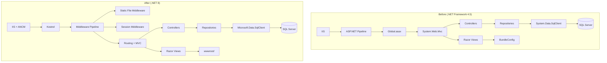
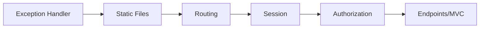

# Technical Design Document: .NET 8 Migration

## Overview

This document describes the technical design for migrating the MIB_FILM_CLD_MM_MVC application from ASP.NET MVC 5 on .NET Framework 4.5 to ASP.NET Core MVC on .NET 8. The migration preserves all existing functionality — authentication, session management, master maintenance CRUD operations, sidebar navigation — while adopting the ASP.NET Core hosting model for deployment on AWS IIS via the ASP.NET Core Module (ANCM).

The migration follows a "lift and shift" strategy: replace framework APIs with their ASP.NET Core equivalents, restructure static assets into `wwwroot`, replace `Web.config` with `appsettings.json`, and replace `Global.asax` with `Program.cs`. No business logic changes are required.

### Key Design Decisions

1. **In-process hosting on IIS** — chosen for performance (avoids inter-process communication overhead) and simplicity on AWS IIS deployments.
2. **In-memory distributed session** — the original app uses in-process session; we replicate this with `AddDistributedMemoryCache()` + `AddSession()`. A Redis/SQL backing store can be added later without code changes.
3. **No bundling/minification framework** — the original `BundleConfig` is unused (commented out in `Global.asax.cs`). Static files are referenced directly in views, which is the simplest approach for this application.
4. **Preserve DataTable-based data access** — the repositories use raw ADO.NET with stored procedures and `DataTable` results. This pattern works identically on .NET 8 with `Microsoft.Data.SqlClient`.
5. **JSON session serialization** — ASP.NET Core session stores byte arrays. We serialize `ACL_UserObj` to JSON for session storage, using extension methods for clean access.

## Architecture

### High-Level Architecture (Before vs After)



### Middleware Pipeline Order



## Components and Interfaces

### 1. Program.cs (replaces Global.asax + Startup)

**Responsibility:** Configure services (DI container) and the HTTP request pipeline.

```csharp
// Program.cs - conceptual structure
var builder = WebApplication.CreateBuilder(args);

// Services
builder.Services.AddControllersWithViews();
builder.Services.AddDistributedMemoryCache();
builder.Services.AddSession(options => {
    options.IdleTimeout = TimeSpan.FromMinutes(5);
    options.Cookie.HttpOnly = true;
    options.Cookie.IsEssential = true;
});
builder.Services.AddSingleton<IConfiguration>(builder.Configuration);
builder.Services.AddHttpContextAccessor();

var app = builder.Build();

// Pipeline
app.UseExceptionHandler("/Home/Error");
app.UseStaticFiles();
app.UseRouting();
app.UseSession();
app.MapControllerRoute(
    name: "default",
    pattern: "{controller=Home}/{action=Index}/{id?}");

app.Run();
```

### 2. SessionExpireFilter (replaces SessionExpireAttribute)

**Responsibility:** Redirect unauthenticated users when session is missing.

```csharp
// Interface: IActionFilter (via ActionFilterAttribute)
public class SessionExpireFilter : ActionFilterAttribute
{
    public override void OnActionExecuting(ActionExecutingContext context)
    {
        var session = context.HttpContext.Session;
        var userJson = session.GetString("AclUser");
        
        if (string.IsNullOrEmpty(userJson))
        {
            var returnUrl = context.HttpContext.Request.Path + context.HttpContext.Request.QueryString;
            var redirectUrl = $"~/Home/Index?ReturnUrl={Uri.EscapeDataString(returnUrl)}";
            context.Result = new RedirectResult(redirectUrl);
            return;
        }
        base.OnActionExecuting(context);
    }
}
```

### 3. Session Extension Methods

**Responsibility:** Provide typed get/set for session objects using JSON serialization.

```csharp
public static class SessionExtensions
{
    public static void SetObject<T>(this ISession session, string key, T value)
    {
        session.SetString(key, JsonConvert.SerializeObject(value));
    }

    public static T GetObject<T>(this ISession session, string key)
    {
        var value = session.GetString(key);
        return value == null ? default : JsonConvert.DeserializeObject<T>(value);
    }
}
```

### 4. Database Base Classes (DatabaseModel.cs, DBModel.cs)

**Responsibility:** Provide SQL Server connectivity using `Microsoft.Data.SqlClient`.

Changes:
- Replace `using System.Data.SqlClient` → `using Microsoft.Data.SqlClient`
- Replace `ConfigurationManager.ConnectionStrings[conn].ConnectionString` → receive connection string via constructor or static configuration accessor

```csharp
public class Database
{
    private static IConfiguration _configuration;
    
    public static void Configure(IConfiguration configuration)
    {
        _configuration = configuration;
    }

    public void OpenConnection(string conn = "PAB_BB")
    {
        command = new SqlCommand();
        c = new SqlConnection(_configuration.GetConnectionString(conn));
        command.Connection = c;
        c.Open();
    }
}
```

### 5. Controllers (HomeController, MstmainController, InquiryController)

**Responsibility:** Handle HTTP requests, unchanged business logic.

Key API replacements:
| Old (.NET Framework) | New (.NET 8) |
|---|---|
| `System.Web.Mvc.Controller` | `Microsoft.AspNetCore.Mvc.Controller` |
| `System.Web.Mvc.ActionResult` | `Microsoft.AspNetCore.Mvc.IActionResult` |
| `HttpContext.Current.User.Identity.Name` | `HttpContext.User.Identity.Name` |
| `Request.UserHostAddress` | `HttpContext.Connection.RemoteIpAddress?.ToString()` |
| `Session["AclUser"]` | `HttpContext.Session.GetObject<ACL_UserObj>("AclUser")` |
| `ConfigurationManager.AppSettings["key"]` | `_configuration["AppSettings:key"]` |
| `[ValidateAntiForgeryToken]` | `[ValidateAntiForgeryToken]` (same attribute, different namespace) |

### 6. HTML Helpers (MyHtml.cs)

**Responsibility:** Provide `BackButton` and `WebAlert` extension methods for Razor views.

```csharp
using Microsoft.AspNetCore.Html;
using Microsoft.AspNetCore.Mvc.Rendering;

public static class MyHtml
{
    public static IHtmlContent BackButton(this IHtmlHelper html, string url = "back")
    {
        var jsact = $"window.location.href ='{url}'; return false;";
        return new HtmlString(
            $"<button class=\"btn btn-primary\" onclick=\"{jsact}\">Back</button>");
    }

    public static IHtmlContent WebAlert(this IHtmlHelper html, string message)
    {
        return new HtmlString($"<script>alert('{message}');</script>");
    }
}
```

### 7. Static File Structure (wwwroot)

```
wwwroot/
├── Content/           (all CSS files, preserving subfolders)
│   ├── font awesome css/
│   ├── style/
│   └── files/
├── Scripts/           (all JS files, preserving subfolders)
│   ├── esm/
│   ├── font awesome js/
│   ├── fontawesome/
│   ├── i18n/
│   ├── jss/
│   └── umd/
├── fonts/             (font files)
├── webfonts/          (Font Awesome webfonts)
├── images/            (if any)
├── videos/            (if any)
└── favicon.ico
```

### 8. Configuration (appsettings.json)

```json
{
  "AppSettings": {
    "SystemName": "FILM LMI"
  },
  "ConnectionStrings": {
    "DBAccess": "Server=...;Database=...;...",
    "PAB_BB": "Server=...;Database=...;..."
  },
  "Logging": {
    "LogLevel": {
      "Default": "Information"
    }
  }
}
```

## Data Models

### Existing Models (Preserved)

All model classes remain structurally identical. The only changes are namespace removals:

- Remove `using System.Web;`
- Remove `using System.Web.Mvc;`
- Remove `using System.Data.Entity;`
- Keep `using System.ComponentModel.DataAnnotations;`
- Replace `CompareAttribute = System.ComponentModel.DataAnnotations.CompareAttribute` (no longer needed — ASP.NET Core uses the DataAnnotations version by default)

### ACL_UserObj Serialization

The `ACL_UserObj` class needs no structural changes but must be JSON-serializable for session storage:

```csharp
public class ACL_UserObj
{
    public int ID_ACL_USER { get; set; }
    public int ID_ACL_ROLE { get; set; }
    public int ID_ACL_RESOURCE { get; set; }
    public string USER_ID { get; set; }
    public string USR_EMAIL { get; set; }
    public string COMPANY { get; set; }
    public string EMP_NO { get; set; }
    public string EMP_NAME { get; set; }
    public string ROLE_NAME { get; set; }
    public string ROLE_DESC { get; set; }
    public string RESOURCE_NAME { get; set; }
    public string RESOURCE_DESC { get; set; }
}
```

### Project File (SDK-style .csproj)

```xml
<Project Sdk="Microsoft.NET.Sdk.Web">
  <PropertyGroup>
    <TargetFramework>net8.0</TargetFramework>
    <RootNamespace>MIB_FILM_CLD_MM_MVC</RootNamespace>
  </PropertyGroup>

  <ItemGroup>
    <PackageReference Include="Microsoft.Data.SqlClient" Version="5.*" />
    <PackageReference Include="Newtonsoft.Json" Version="13.*" />
  </ItemGroup>
</Project>
```

The `wwwroot` folder is automatically included in publish output by the Web SDK — no explicit `<Content>` glob is needed.

## Error Handling

### Global Exception Handling

The original application uses `HandleErrorAttribute` as a global filter. In ASP.NET Core, this is replaced by the exception handling middleware:

```csharp
if (app.Environment.IsDevelopment())
{
    app.UseDeveloperExceptionPage();
}
else
{
    app.UseExceptionHandler("/Home/Error");
}
```

The `Views/Shared/Error.cshtml` view is preserved and will render for unhandled exceptions in production.

### Database Connection Errors

The existing pattern of catching `SqlException` in the `Database` base classes is preserved. No changes to error handling logic within repositories.

### Missing Configuration

At startup, the application validates that required configuration values are present:

```csharp
var connectionString = builder.Configuration.GetConnectionString("PAB_BB")
    ?? throw new InvalidOperationException("Connection string 'PAB_BB' is not configured in appsettings.json");

var dbAccessConnStr = builder.Configuration.GetConnectionString("DBAccess")
    ?? throw new InvalidOperationException("Connection string 'DBAccess' is not configured in appsettings.json");

var systemName = builder.Configuration["AppSettings:SystemName"]
    ?? throw new InvalidOperationException("'AppSettings:SystemName' is not configured in appsettings.json");
```

### Session Expiry

When session expires, the `SessionExpireFilter` redirects to the login page. This is a controlled flow, not an error condition. The filter preserves the original URL as `ReturnUrl` for post-login redirect.

## Testing Strategy

### Approach

This is a migration project — the primary validation is that the migrated application behaves identically to the original. Testing focuses on:

1. **Build verification** — the project compiles and publishes successfully on .NET 8
2. **Smoke tests** — application starts, serves static files, and renders views
3. **Integration tests** — controllers return expected responses, session management works, database connectivity is maintained
4. **Manual regression** — verify UI renders identically, all CRUD operations work

### Why Property-Based Testing Does NOT Apply

This migration is primarily about:
- Configuration changes (project file, appsettings.json, web.config)
- Namespace/API surface replacements (System.Web.Mvc → Microsoft.AspNetCore.Mvc)
- Infrastructure wiring (middleware pipeline, DI registration)
- Static file reorganization

These are not pure functions with varied inputs. The password hashing functions (`HashPassword`/`VerifyHashedPassword`) are the only candidates, but they use a well-known algorithm (`Rfc2898DeriveBytes`) that doesn't change during migration — the test is simply "does the existing hash still verify?" which is a single example-based test, not a property requiring 100+ iterations.

**PBT is skipped for this feature.** Example-based unit tests and integration tests are the appropriate strategy.

### Test Categories

| Category | What to Test | How |
|---|---|---|
| Build | Project compiles on .NET 8 | `dotnet build` |
| Publish | Output contains all static assets | `dotnet publish` + verify wwwroot contents |
| Startup | App starts without exceptions | Integration test with `WebApplicationFactory` |
| Static Files | CSS/JS/fonts served with correct MIME types | HTTP GET requests in integration tests |
| Session | Login stores session, filter redirects when expired | Integration tests |
| Password | Existing hashes still verify on .NET 8 | Unit test with known hash/password pair |
| Database | Repositories connect and execute stored procedures | Integration test against test database |
| Views | Pages render without errors | Integration tests checking 200 status codes |
| IIS | web.config generated in publish output | Verify file exists after `dotnet publish` |

### Unit Tests (Example-Based)

- `VerifyHashedPassword` returns true for a known valid hash/password pair
- `HashPassword` produces a 49-byte base64 string (1 marker + 16 salt + 32 key)
- `SessionExtensions.SetObject/GetObject` round-trips an `ACL_UserObj` correctly
- `ConvertToList<T>` maps DataTable columns to object properties correctly
- `SessionExpireFilter` redirects when session is empty
- `SessionExpireFilter` allows request when session contains user

### Integration Tests

- Application starts via `WebApplicationFactory<Program>`
- GET `/` returns 200 and contains login form
- POST `/Home/Login` with valid credentials sets session
- GET `/Home/Menu` without session redirects to `/Home/Index`
- Static file requests (e.g., `/Content/bootstrap.min.css`) return 200 with correct content-type
- `dotnet publish` output contains `web.config` and `wwwroot/` with all assets

