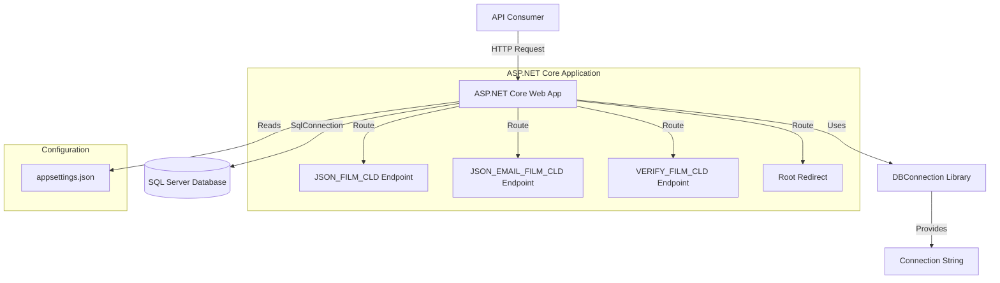

# Design Document: .NET Framework 4.5 to .NET 8 Migration

## Overview

This design document specifies the technical approach for migrating a .NET Framework 4.5 ASP.NET Web Application to .NET 8 while maintaining **100% functional compatibility**. The migration preserves all existing endpoint behaviors, response formats, and database access patterns to ensure zero breaking changes for API consumers.

### Design Principles

1. **Functional Preservation**: All endpoints must behave identically to the legacy application
2. **Minimal Refactoring**: Preserve existing logic patterns (ADO.NET, manual JSON serialization) rather than modernizing
3. **Backward Compatibility**: Maintain exact URL paths including .ashx and .aspx extensions
4. **Configuration Modernization**: Move from Web.config to appsettings.json while preserving connection string format
5. **SDK-Style Projects**: Use modern project format for simplified dependency management

### Migration Scope

**In Scope:**
- Convert projects to .NET 8 SDK-style format
- Migrate HTTP handlers to ASP.NET Core endpoints
- Migrate Web Forms page to ASP.NET Core endpoint
- Move configuration from Web.config to appsettings.json
- Update namespace references (System.Web → Microsoft.AspNetCore)

**Out of Scope:**
- Replacing manual JSON serialization with System.Text.Json
- Converting to async/await patterns
- Implementing dependency injection for database access
- Adding middleware for cross-cutting concerns
- Modernizing error handling patterns

## Architecture

### High-Level Architecture



### Project Structure Transformation

**Before (Legacy):**
```
MIB_FILM_CLD.sln
├── DBConnection/
│   ├── DBConnection.csproj (Old-style)
│   └── ConnectionString.cs
└── MIB_FILM_CLD/
    ├── MIB_FILM_CLD.csproj (Old-style)
    ├── Web.config
    ├── JSON_FILM_CLD.ashx + .ashx.cs
    ├── JSON_EMAIL_FILM_CLD.ashx + .ashx.cs
    └── VERIFY_FILM_CLD.aspx + .aspx.cs
```

**After (Migrated):**
```
MIB_FILM_CLD.sln
├── DBConnection/
│   ├── DBConnection.csproj (SDK-style)
│   └── ConnectionString.cs
└── MIB_FILM_CLD/
    ├── MIB_FILM_CLD.csproj (SDK-style)
    ├── appsettings.json
    ├── Program.cs
    └── Endpoints/
        ├── JsonFilmEndpoint.cs
        ├── JsonEmailEndpoint.cs
        └── VerifyEndpoint.cs
```

## Components and Interfaces

### 1. DBConnection Library

**Purpose**: Provide SQL Server connection string to the web application

**Migration Strategy**: Convert to SDK-style project targeting .NET 8, preserve existing class structure

**Component Details:**

```csharp
// ConnectionString.cs - PRESERVED AS-IS
namespace DBConnection
{
    public class ConnectionString
    {
        public static string FILM_CLD { get; set; }
    }
}
```

**Key Changes:**
- Project file: Convert to SDK-style format
- Target framework: Change from `net45` to `net8.0`
- Connection string: Change from hardcoded static value to property that will be set from configuration
- Public API: **No changes** - same class name, namespace, property name, and access pattern

**Project File (DBConnection.csproj):**
```xml
<Project Sdk="Microsoft.NET.Sdk">
  <PropertyGroup>
    <TargetFramework>net8.0</TargetFramework>
    <RootNamespace>DBConnection</RootNamespace>
    <AssemblyName>DBConnection</AssemblyName>
  </PropertyGroup>
</Project>
```

### 2. Web Application Entry Point

**Purpose**: Configure ASP.NET Core pipeline and register endpoints

**Component Details:**

```csharp
// Program.cs - NEW FILE
using DBConnection;

var builder = WebApplication.CreateBuilder(args);

// Initialize connection string from configuration
ConnectionString.FILM_CLD = builder.Configuration.GetConnectionString("FILM_CLD");

var app = builder.Build();

// Register endpoints with exact legacy paths
app.MapGet("/JSON_FILM_CLD.ashx", JsonFilmEndpoint.HandleRequest);
app.MapGet("/JSON_EMAIL_FILM_CLD.ashx", JsonEmailEndpoint.HandleRequest);
app.MapGet("/VERIFY_FILM_CLD.aspx", VerifyEndpoint.HandleRequest);

// Root redirect to verification page
app.MapGet("/", () => Results.Redirect("/VERIFY_FILM_CLD.aspx"));

app.Run();
```

**Design Decisions:**
- Use Minimal APIs (MapGet) for simplicity and performance
- Preserve .ashx and .aspx extensions in routes for backward compatibility
- Initialize static connection string at startup (matches legacy pattern)
- No middleware for CORS, authentication, or error handling (not in legacy app)

### 3. JSON Data Retrieval Endpoint

**Purpose**: Query database and return JSONP-formatted response

**Legacy Implementation Analysis:**
- Accepts query parameters: TYPE, UUID, CALLBACK
- Calls stored procedure: MIB_MOBILE_GET_DATA
- Returns DataTable results
- Manually serializes to JSON with custom logic:
  - String columns: wrapped in quotes (except "true"/"false")
  - Non-string columns: no quotes
  - Wraps result in callback function: `{callback: [...]}`

**Migration Strategy**: Preserve exact JSON serialization logic to ensure byte-for-byte compatibility

**Component Details:**

```csharp
// Endpoints/JsonFilmEndpoint.cs
using System.Data;
using System.Data.SqlClient;
using Microsoft.AspNetCore.Http;
using DBConnection;

namespace MIB_FILM_CLD.Endpoints
{
    public static class JsonFilmEndpoint
    {
        public static IResult HandleRequest(HttpContext context)
        {
            string pType = context.Request.Query["TYPE"];
            string pUuid = context.Request.Query["UUID"];
            string callback = context.Request.Query["CALLBACK"];

            DataTable dtResult = GetFilmMobileData(pType, pUuid);
            string jsonResponse = SerializeToJson(dtResult, callback);

            return Results.Content(jsonResponse, "application/json");
        }

        private static DataTable GetFilmMobileData(string pType, string pUuid)
        {
            DataTable dtResult = new DataTable();
            using (SqlConnection conn = new SqlConnection(ConnectionString.FILM_CLD))
            {
                SqlCommand cmd = new SqlCommand();
                conn.Open();
                cmd.Connection = conn;
                cmd.CommandText = "MIB_MOBILE_GET_DATA";
                cmd.CommandType = CommandType.StoredProcedure;
                cmd.CommandTimeout = 0;
                cmd.Parameters.Clear();
                cmd.Parameters.Add(new SqlParameter("@P_TYPE", pType)).Direction = ParameterDirection.Input;
                cmd.Parameters.Add(new SqlParameter("@P_UUID", pUuid)).Direction = ParameterDirection.Input;
                dtResult.Load(cmd.ExecuteReader());
                conn.Close();
                cmd.Dispose();
            }
            return dtResult;
        }

        private static string SerializeToJson(DataTable dt, string callback)
        {
            // PRESERVE EXACT LEGACY SERIALIZATION LOGIC
            string jsonString = "";
            jsonString = jsonString + "{\"" + callback + "\":[";

            for (int i = 0; i <= dt.Rows.Count - 1; i++)
            {
                jsonString = jsonString + "{";
                for (int ii = 0; ii <= dt.Columns.Count - 1; ii++)
                {
                    if (dt.Columns[ii].DataType.Name == "String")
                    {
                        string zz = "";
                        if (dt.Rows[i][ii].ToString() == "true" || dt.Rows[i][ii].ToString() == "false")
                            zz = dt.Rows[i][ii].ToString();
                        else
                            zz = "\"" + dt.Rows[i][ii].ToString() + "\"";

                        jsonString = jsonString + "\"" + dt.Columns[ii].ColumnName + "\":" + zz;
                    }
                    else
                    {
                        jsonString = jsonString + "\"" + dt.Columns[ii].ColumnName + "\":" + dt.Rows[i][ii].ToString();
                    }

                    if (ii != dt.Columns.Count - 1)
                    {
                        jsonString = jsonString + ",";
                    }
                }

                if (i == dt.Rows.Count - 1)
                    jsonString = jsonString + "}";
                else
                    jsonString = jsonString + "},";
            }
            jsonString = jsonString + "]}";
            return jsonString;
        }
    }
}
```

**Critical Preservation Points:**
- Manual string concatenation for JSON (not System.Text.Json)
- Exact same logic for string vs non-string column handling
- Exact same logic for "true"/"false" special case
- Same JSONP callback wrapping format
- Same ADO.NET pattern: SqlConnection, SqlCommand, CommandTimeout=0, ExecuteReader

### 4. Email Verification Endpoint

**Purpose**: Send verification email via stored procedure

**Legacy Implementation Analysis:**
- Accepts query parameters: EMPNO, UUID, NAME
- Validates EMPNO and UUID are non-empty
- Calls stored procedure: PSP_MIB_APPS_VERIFY_SEND
- Returns RETURN_VALUE output parameter or "2" for validation failure

**Migration Strategy**: Preserve exact validation and response logic

**Component Details:**

```csharp
// Endpoints/JsonEmailEndpoint.cs
using System.Data;
using System.Data.SqlClient;
using Microsoft.AspNetCore.Http;
using DBConnection;

namespace MIB_FILM_CLD.Endpoints
{
    public static class JsonEmailEndpoint
    {
        public static IResult HandleRequest(HttpContext context)
        {
            string pEmpno = context.Request.Query["EMPNO"];
            string pUuid = context.Request.Query["UUID"];
            string pName = context.Request.Query["NAME"];

            string result;
            if (pEmpno != "" && pEmpno != null && pUuid != "" && pUuid != null)
            {
                result = SendEmailVerify(pEmpno, pUuid, pName);
            }
            else
            {
                result = "2";
            }

            return Results.Content(result, "application/json");
        }

        private static string SendEmailVerify(string pEmpno, string pUuid, string pName)
        {
            using (SqlConnection conn = new SqlConnection(ConnectionString.FILM_CLD))
            {
                SqlCommand cmd = new SqlCommand();
                conn.Open();
                cmd.Connection = conn;
                cmd.CommandText = "PSP_MIB_APPS_VERIFY_SEND";
                cmd.CommandType = CommandType.StoredProcedure;
                cmd.CommandTimeout = 0;
                cmd.Parameters.Clear();
                cmd.Parameters.Add(new SqlParameter("P_EMPNO", pEmpno)).Direction = ParameterDirection.Input;
                cmd.Parameters.Add(new SqlParameter("P_UUID", pUuid)).Direction = ParameterDirection.Input;
                cmd.Parameters.Add(new SqlParameter("P_NAME", pName)).Direction = ParameterDirection.Input;
                cmd.Parameters.Add(new SqlParameter("RETURN_VALUE", SqlDbType.VarChar, 1)).Direction = ParameterDirection.Output;
                cmd.ExecuteReader();
                conn.Close();
                
                string returnValue = cmd.Parameters["RETURN_VALUE"].Value.ToString();
                cmd.Dispose();
                return returnValue;
            }
        }
    }
}
```

**Critical Preservation Points:**
- Exact same validation logic: `!= "" && != null` for both EMPNO and UUID
- Return "2" for validation failure (not HTTP 400)
- Same ADO.NET pattern with output parameter retrieval
- Content-Type: application/json (even though response is plain text)

### 5. Verification Page Endpoint

**Purpose**: Process verification link and display HTML response

**Legacy Implementation Analysis:**
- Accepts query parameter: VERIFYID
- Calls stored procedure: PSP_MIB_APPS_VERIFY_RECEIVE
- Returns HTML_RETURN output parameter
- Returns "Invalid Verify ID." for missing/empty VERIFYID

**Migration Strategy**: Convert Web Forms page to endpoint returning HTML content

**Component Details:**

```csharp
// Endpoints/VerifyEndpoint.cs
using System.Data;
using System.Data.SqlClient;
using Microsoft.AspNetCore.Http;
using DBConnection;

namespace MIB_FILM_CLD.Endpoints
{
    public static class VerifyEndpoint
    {
        public static IResult HandleRequest(HttpContext context)
        {
            string pVerifyId = context.Request.Query["VERIFYID"];
            string htmlContent;

            if (pVerifyId != null && pVerifyId != "")
            {
                htmlContent = ProcessVerification(pVerifyId);
            }
            else
            {
                htmlContent = "Invalid Verify ID.";
            }

            return Results.Content(htmlContent, "text/html");
        }

        private static string ProcessVerification(string pVerifyId)
        {
            using (SqlConnection conn = new SqlConnection(ConnectionString.FILM_CLD))
            {
                SqlCommand cmd = new SqlCommand();
                conn.Open();
                cmd.Connection = conn;
                cmd.CommandText = "PSP_MIB_APPS_VERIFY_RECEIVE";
                cmd.CommandType = CommandType.StoredProcedure;
                cmd.CommandTimeout = 0;
                cmd.Parameters.Clear();
                cmd.Parameters.Add(new SqlParameter("P_VERIFY_ID", pVerifyId)).Direction = ParameterDirection.Input;
                cmd.Parameters.Add(new SqlParameter("HTML_RETURN", SqlDbType.VarChar, 1000)).Direction = ParameterDirection.Output;
                cmd.ExecuteReader();
                conn.Close();
                
                string htmlReturn = cmd.Parameters["HTML_RETURN"].Value.ToString();
                cmd.Dispose();
                return htmlReturn;
            }
        }
    }
}
```

**Critical Preservation Points:**
- Exact same validation logic: `!= null && != ""`
- Return "Invalid Verify ID." message (exact text)
- Content-Type: text/html
- Same ADO.NET pattern with VARCHAR(1000) output parameter

## Data Models

### Connection String Configuration

**Legacy Format (Web.config):**
```xml
<connectionStrings>
  <add name="FILM_CLD" 
       connectionString="Data Source=10.211.1.4\PFRDB,49820; Initial Catalog=PFR_LMI;User ID=PFRlmi;Password=PFR2lmi$;MultipleActiveResultSets=True;Max Pool Size=500;Asynchronous Processing=True;" />
</connectionStrings>
```

**Migrated Format (appsettings.json):**
```json
{
  "ConnectionStrings": {
    "FILM_CLD": "Data Source=10.211.1.4\\PFRDB,49820; Initial Catalog=PFR_LMI;User ID=PFRlmi;Password=PFR2lmi$;MultipleActiveResultSets=True;Max Pool Size=500;Asynchronous Processing=True;"
  },
  "Logging": {
    "LogLevel": {
      "Default": "Information",
      "Microsoft.AspNetCore": "Warning"
    }
  },
  "AllowedHosts": "*"
}
```

**Note**: Backslash in server name must be escaped in JSON (`\\` instead of `\`)

### Database Interaction Models

The application does not use entity models or DTOs. All database interactions use:
- **Input**: Query string parameters (string values)
- **Processing**: ADO.NET SqlParameter objects
- **Output**: DataTable (for JSON endpoint) or output parameter values (for other endpoints)

This pattern is **preserved as-is** to maintain functional compatibility.

## Error Handling

### Legacy Error Handling Behavior

The legacy application has minimal error handling:
- No try-catch blocks in endpoint handlers
- No global exception handling
- Database errors propagate to client as HTTP 500
- No logging of errors

### Migrated Error Handling Strategy

**Preserve legacy behavior** to maintain compatibility:
- No try-catch blocks in endpoint code
- Allow ASP.NET Core default exception handling (returns HTTP 500)
- No custom error pages or middleware
- No structured logging of errors

**Rationale**: Adding error handling could change response formats or status codes, breaking API consumer expectations.

**Future Enhancement** (out of scope): After migration validation, consider adding:
- Global exception middleware
- Structured logging
- Custom error response formats
- Health check endpoints

## Testing Strategy

### Testing Approach

This migration is **not suitable for property-based testing** because:
1. It's primarily infrastructure/configuration changes (IaC-like)
2. The core logic is database stored procedures (external system)
3. The application is a thin HTTP-to-database adapter
4. Behavior is deterministic and doesn't vary meaningfully with input structure

**Appropriate Testing Strategy:**

1. **Integration Tests** (1-3 examples per endpoint)
2. **Manual Comparison Tests** (legacy vs migrated responses)
3. **Smoke Tests** (application starts, endpoints respond)

### Test Categories

#### 1. Smoke Tests

**Purpose**: Verify application starts and basic connectivity

**Test Cases:**
- Application builds without errors
- Application starts successfully
- All endpoints return HTTP 200 for valid requests
- Database connection succeeds

#### 2. Integration Tests

**Purpose**: Verify each endpoint produces correct responses

**Test Cases:**

**JSON_FILM_CLD Endpoint:**
- Valid request with TYPE, UUID, CALLBACK → Returns JSONP response
- Response format matches legacy format (callback wrapping, field names, value formatting)
- Multiple rows returned correctly
- String columns with "true"/"false" values handled correctly

**JSON_EMAIL_FILM_CLD Endpoint:**
- Valid request with EMPNO, UUID, NAME → Returns stored procedure result
- Missing EMPNO → Returns "2"
- Missing UUID → Returns "2"
- Empty EMPNO → Returns "2"
- Empty UUID → Returns "2"

**VERIFY_FILM_CLD Endpoint:**
- Valid request with VERIFYID → Returns HTML from stored procedure
- Missing VERIFYID → Returns "Invalid Verify ID."
- Empty VERIFYID → Returns "Invalid Verify ID."

**Root Redirect:**
- Request to "/" → Redirects to "/VERIFY_FILM_CLD.aspx"

#### 3. Comparison Tests

**Purpose**: Verify migrated responses match legacy responses byte-for-byte

**Approach:**
1. Deploy legacy and migrated applications side-by-side
2. Send identical requests to both
3. Compare responses (status code, headers, body)
4. Document any differences

**Test Cases:**
- Same request to JSON_FILM_CLD on both apps → Identical JSON structure
- Same request to JSON_EMAIL_FILM_CLD on both apps → Identical response value
- Same request to VERIFY_FILM_CLD on both apps → Identical HTML content

#### 4. Database Integration Tests

**Purpose**: Verify stored procedure calls work correctly

**Test Cases:**
- MIB_MOBILE_GET_DATA called with correct parameters
- PSP_MIB_APPS_VERIFY_SEND called with correct parameters
- PSP_MIB_APPS_VERIFY_RECEIVE called with correct parameters
- Output parameters retrieved correctly
- Connection opened and closed properly

### Test Implementation

**Unit Test Framework**: xUnit (standard for .NET 8)

**Test Project Structure:**
```
MIB_FILM_CLD.Tests/
├── MIB_FILM_CLD.Tests.csproj
├── SmokeTests.cs
├── JsonFilmEndpointTests.cs
├── JsonEmailEndpointTests.cs
└── VerifyEndpointTests.cs
```

**Sample Test (Integration Test):**
```csharp
public class JsonEmailEndpointTests
{
    [Fact]
    public async Task HandleRequest_WithValidParameters_ReturnsStoredProcedureResult()
    {
        // Arrange
        var context = CreateHttpContext(
            queryParams: new Dictionary<string, string>
            {
                ["EMPNO"] = "12345",
                ["UUID"] = "test-uuid-123",
                ["NAME"] = "Test User"
            });

        // Act
        var result = JsonEmailEndpoint.HandleRequest(context);

        // Assert
        Assert.IsType<ContentResult>(result);
        var contentResult = (ContentResult)result;
        Assert.Equal("application/json", contentResult.ContentType);
        Assert.NotEqual("2", contentResult.Content); // Should not be validation failure
    }

    [Fact]
    public async Task HandleRequest_WithMissingEmpno_ReturnsTwo()
    {
        // Arrange
        var context = CreateHttpContext(
            queryParams: new Dictionary<string, string>
            {
                ["UUID"] = "test-uuid-123",
                ["NAME"] = "Test User"
            });

        // Act
        var result = JsonEmailEndpoint.HandleRequest(context);

        // Assert
        var contentResult = (ContentResult)result;
        Assert.Equal("2", contentResult.Content);
    }
}
```

### Test Execution Strategy

1. **Pre-Migration**: Run tests against legacy application to establish baseline
2. **During Migration**: Run tests against migrated application to verify behavior
3. **Post-Migration**: Run comparison tests to validate identical behavior
4. **Deployment**: Run smoke tests in production environment

### Success Criteria

Migration is successful when:
- All smoke tests pass
- All integration tests pass
- All comparison tests show identical responses
- No errors in application logs during test execution
- API consumers report no issues with migrated endpoints

## Migration Implementation Plan

### Phase 1: Project Structure Migration

**Steps:**
1. Create new .NET 8 solution structure
2. Convert DBConnection.csproj to SDK-style
3. Convert MIB_FILM_CLD.csproj to SDK-style
4. Update solution file references
5. Create appsettings.json with connection string
6. Create Program.cs entry point

**Validation:**
- Solution builds successfully
- No compilation errors
- Connection string accessible from configuration

### Phase 2: Endpoint Migration

**Steps:**
1. Create Endpoints folder
2. Implement JsonFilmEndpoint.cs (preserve JSON serialization logic)
3. Implement JsonEmailEndpoint.cs (preserve validation logic)
4. Implement VerifyEndpoint.cs (convert from Web Forms)
5. Register all endpoints in Program.cs
6. Add root redirect

**Validation:**
- All endpoints respond to requests
- Response content types correct
- Query parameters parsed correctly

### Phase 3: Database Access Migration

**Steps:**
1. Update ConnectionString.cs to use property instead of hardcoded value
2. Initialize connection string in Program.cs startup
3. Verify ADO.NET code works in .NET 8
4. Test stored procedure calls
5. Verify output parameter retrieval

**Validation:**
- Database connections succeed
- Stored procedures execute correctly
- Output parameters retrieved correctly
- Connections closed properly

### Phase 4: Testing and Validation

**Steps:**
1. Create test project
2. Implement smoke tests
3. Implement integration tests
4. Run comparison tests against legacy app
5. Document any differences
6. Fix any compatibility issues

**Validation:**
- All tests pass
- Responses match legacy application
- No breaking changes identified

### Phase 5: Deployment Preparation

**Steps:**
1. Create deployment documentation
2. Update configuration for production environment
3. Create rollback plan
4. Prepare monitoring and logging
5. Conduct final validation

**Validation:**
- Deployment documentation complete
- Configuration validated
- Rollback plan tested
- Monitoring in place

## Deployment Considerations

### Hosting Requirements

**Legacy (.NET Framework 4.5):**
- Windows Server with IIS
- .NET Framework 4.5 runtime
- SQL Server connectivity

**Migrated (.NET 8):**
- Windows Server, Linux, or Docker container
- .NET 8 runtime
- SQL Server connectivity
- Kestrel web server (or IIS with ASP.NET Core Module)

### Configuration Management

**Environment-Specific Settings:**
- Connection string (dev vs production)
- Logging levels
- Allowed hosts

**Approach:**
- Use appsettings.json for default settings
- Use appsettings.{Environment}.json for environment overrides
- Use environment variables for sensitive data (passwords)

### Rollback Strategy

**If migration issues occur:**
1. Switch traffic back to legacy application
2. Investigate issues in migrated application
3. Fix issues and redeploy
4. Gradually shift traffic back to migrated application

**Prerequisites for rollback:**
- Keep legacy application deployed and running
- Use load balancer or reverse proxy for traffic switching
- Monitor both applications during transition period

### Performance Considerations

**Expected Performance Changes:**
- **Startup time**: Faster (no Web Forms compilation)
- **Request throughput**: Similar or slightly better (Kestrel vs IIS)
- **Memory usage**: Lower (no Web Forms overhead)
- **Database performance**: Identical (same ADO.NET code)

**Monitoring Metrics:**
- Request latency (should be similar to legacy)
- Error rate (should be zero for valid requests)
- Database connection pool usage
- Memory and CPU utilization

## Security Considerations

### Authentication and Authorization

**Legacy Application**: No authentication or authorization

**Migrated Application**: No authentication or authorization (preserve legacy behavior)

**Note**: This is a security concern but out of scope for migration. Consider adding authentication in a future enhancement.

### Connection String Security

**Legacy Approach**: Hardcoded in source code (security risk)

**Migrated Approach**: Stored in appsettings.json (still a risk if committed to source control)

**Recommendation**: Use environment variables or Azure Key Vault for production deployment

### SQL Injection Protection

**Current State**: Using parameterized queries (SqlParameter) - **secure**

**Migrated State**: Same parameterized queries - **secure**

**No changes needed**: Existing code already follows best practices

### HTTPS/TLS

**Legacy Application**: Configured in IIS

**Migrated Application**: Configure in Kestrel or reverse proxy

**Recommendation**: Enforce HTTPS in production environment

## Appendix: Key Differences Between .NET Framework and .NET 8

### Namespace Changes

| .NET Framework 4.5 | .NET 8 |
|-------------------|--------|
| System.Web | Microsoft.AspNetCore |
| System.Web.UI | N/A (no Web Forms) |
| IHttpHandler | Minimal API endpoints |
| HttpContext (System.Web) | HttpContext (Microsoft.AspNetCore.Http) |

### Project File Changes

| .NET Framework 4.5 | .NET 8 |
|-------------------|--------|
| Old-style .csproj (verbose XML) | SDK-style .csproj (minimal) |
| packages.config | PackageReference in .csproj |
| Web.config | appsettings.json |
| Global.asax | Program.cs |

### ADO.NET Compatibility

**Good News**: ADO.NET (System.Data.SqlClient) works identically in .NET 8

**No changes needed** for:
- SqlConnection
- SqlCommand
- SqlParameter
- DataTable
- ExecuteReader

### Deployment Changes

| .NET Framework 4.5 | .NET 8 |
|-------------------|--------|
| IIS only | IIS, Kestrel, Docker, Linux |
| Windows Server only | Cross-platform |
| Framework-dependent | Self-contained or framework-dependent |
| .NET Framework runtime | .NET 8 runtime |

